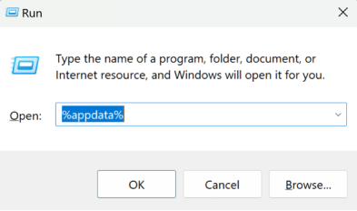
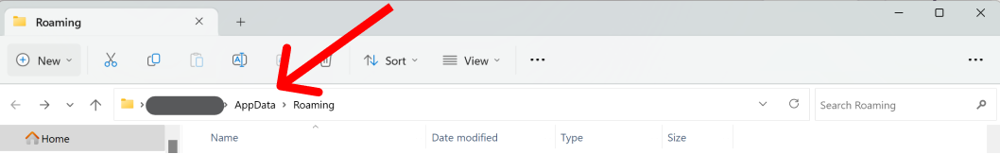
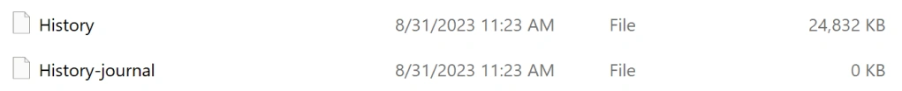
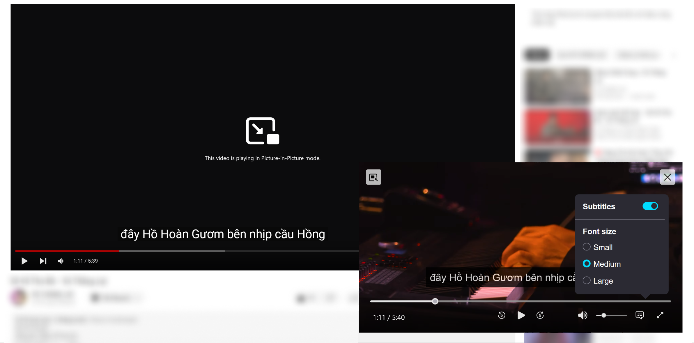
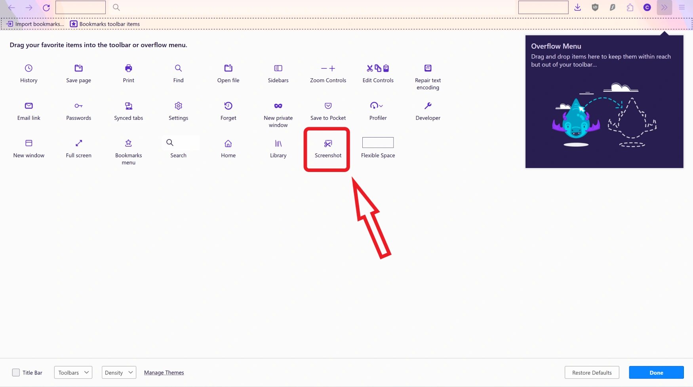

import HorizontalBarChart from '@components/items/pages/blog/HorizontalBarChart.svelte';
import MinimalYoutubeEmbed from '@components/items/pages/blog/MinimalYoutubeEmbed.astro';

Mình đã dùng Brave kể từ lúc nó mới ra mắt, sau đó mình đã thử sơ qua Firefox nhưng do không chuyển dữ liệu từ Brave sang, nên chỉ sau vài ngày thì phải quay lại Brave bởi mình cần xem lịch sử duyệt web.\
Ngay khi Firefox cập nhật phiên bản 116 mình đã chuyển toàn bộ dữ liệu từ Brave sang Firefox để thử lại khi phiên bản này Firefox đã thêm thanh điều chỉnh âm lượng vào tính năng PiP (Hình trong Hình).

Sử dụng Firefox _Nightly_ trong vòng bốn tháng, mình sẽ chia sẻ trải nghiệm của mình với bản build _nightly_ của trình duyệt này.

## Sao Lại Là Firefox?

-  Hỗ trợ [uBlock Origin](https://github.com/gorhill/uBlock) tốt hơn. ([Dẫn chứng](https://github.com/gorhill/uBlock/wiki/uBlock-Origin-works-best-on-Firefox))
-  Tích hợp tính năng Hình trong Hình (PiP).
-  Tích hợp tính năng chụp màn hình.
-  [Firefox Relay](https://relay.firefox.com/) - Dịch vụ ẩn email.
-  Tìm kiếm trải nghiệm mới.

## Chuyển Dữ Liệu

Việc chuyển dữ liệu từ Brave sang Firefox không hề dễ. Mình đã phải Google một lúc để biết được cách chuyển dữ liệu.

### Chuyển lịch sử duyệt web

Vì Firefox không hỗ trợ nhập dữ liệu trực tiếp từ Brave (và chắc là các trình duyệt khác cũng không hỗ trợ), sau khi tìm tòi, mình đã tìm được một cách:\
 ➡️ Do Firefox hỗ trợ nhập lịch sử từ Edge, mà Brave và Edge bản mới đều sử dụng nhân Chromium, mình sẽ copy thủ công lịch sử của Brave sang Edge, rồi từ đó nhập lịch sử của Edge vào Firefox. _Cũng có thể sử dụng Chrome để làm điều tương tự._

   
Cách thức

      **Bước 1: Copy lịch sử Brave sang Edge/Chrome**
      - Mở _Run_: <kbd class="kbd text-base-content">Windows ⌘</kbd> + <kbd class="kbd text-base-content">R</kbd>
      - Nhập: `%appdata%` rồi nhấn OK.
      
      - Khi File Explorer mở, nếu đang ở _Roaming_, nhấn _AppData_ rồi vào thư mục _Local_.
      
      - Mở _BraveSoftware_ > _Brave_Browser_ (_Brave_Browser-Beta_ nếu dùng bản Beta) > _User Data_.
      - Copy file `History` và `History-journal`.
      
      - Quay lại thư mục _Local_, mở _Edge_ (Chromium Edge) User Data folder: _Microsoft_ > _Edge_ > _User Data_ rồi paste lại file đã copy.

      **Bước 2: Nhập lịch sử từ Edge vào Firefox**
      - Mở _Firefox_ > _Settings_ > _General_ > _Import Browser Data_ > _Import Data_ > Select _Microsoft Edge - Profile_, tick tuỳ chọn _Select All_ > Import.

### Chuyển mật khẩu và tài khoản
Bản Firefox mới nhất hỗ trợ nhập mật khẩu từ file .csv, rất dễ để chuyển mật khẩu.

   
Cách thức

      **Bước 1: Xuất mật khẩu Brave**
      - Mở _Brave_ > _Settings_ > _Autofill & Passwords_, ở phần _Saved Passwords_ click <kbd class="kbd text-base-content">⫶</kbd> rồi chọn `Export Passwords`.

      **Bước 2: Nhập file mật khẩu vào Firefox**
      - Mở _Firefox_ > <kbd class="kbd text-base-content">☰</kbd> _Menu_  > _Passwords_ > <kbd class='kbd'>⋯</kbd> _Options_ > _Import from a File..._ > Chọn file `Passwords.csv` đã xuất trước đó.

     > Nhớ xoá file `Passwords.csv` khi xong việc.

### Chuyển bookmarks
Cũng giống như cách chuyển mật khẩu.

   
Cách thức

      **Bước 1: Xuất bookmark Brave**
      - Mở _Brave_ > <kbd class="kbd text-base-content">Ctrl</kbd> + <kbd class="kbd text-base-content">Shift</kbd> + <kbd class="kbd text-base-content">O</kbd> > <kbd class='kbd'>⋯</kbd> _Tuỳ chọn_ > _Export Bookmarks_.

      **Bước 2: Nhập file bookmark vào Firefox**
      - Mở _Firefox_ > <kbd class="kbd text-base-content">Ctrl</kbd> + <kbd class="kbd text-base-content">Shift</kbd> + <kbd class="kbd text-base-content">O</kbd> > <kbd class='kbd'>⋯</kbd> _Tuỳ chọn_ > _Import and Backup_ > _Import Bookmarks from HTML..._ > Chọn file `Bookmarks.html` đã xuất.

## Những Tính Năng "Hay Ho" Của Firefox

### Picture-in-Picture tích hợp

Một tính năng nổi bật của Firefox. Nếu muốn sử dụng tính năng này trên Chrome, chúng ta sẽ phải cài một extension nhưng lại không có nhiều tính năng.
Nếu trên Chromium Picture-in-Picture chỉ có thể play/pause, thì trên Firefox còn có thể lùi/tua, chỉnh âm lượng và coi phụ đề.

### Chụp màn hình tích hợp

Mới đây mình mới biết rằng Chrome cũng có [tính năng chụp màn hình tích hợp](https://zapier.com/blog/full-page-screenshots-in-chrome/), tuy nhiên cách sử dụng rất phức tạp. Firefox thì sao nhỉ?

-  Click chuột phải vào toolbar, click _Customize Toolbar_, kéo nút _Screenshot_ lên toolbar để bắt đầu sử dụng.
   

Mở một website, nhấn nút _Screenshot_. Lúc này có thể:

-  Chụp nguyên trang (Dù dài hay ngắn).
-  Chụp phần đang nhìn thấy.
-  Kéo thả để chụp phần đã chọn.
-  Nhấn để chọn chụp một phần tử.

## Vài Vấn Đề Của Firefox

**Firefox hiện có một vài vấn đề sau:**

-  Hiệu năng kém hơn
-  Không có View Transitions API
-  Ít extension (add-on)

### Hiệu năng

Đây là kết quả khi mình chạy một vài test trên Firefox (_116_), Firefox Nightly (_118a1_), Brave Beta (_v1.58.106, Chromium 116_), Microsoft Edge (_116.0.1938.62_) bằng máy tính cá nhân:

<HorizontalBarChart
   chartTitle="BaseMark Score"
   dataArr={[805, 984, 1213, 1382]}
   arrName={['Firefox', 'Firefox Nightly', 'Brave Beta', 'Microsoft Edge']}
   chartNote="Càng cao, càng tốt."
   client:idle
/>
 
<HorizontalBarChart
   chartTitle="Speedometer Score"
   dataArr={[196, 221, 372, 387]}
   arrName={['Firefox', 'Firefox Nightly', 'Brave Beta', 'Microsoft Edge']}
   chartNote="Càng cao, càng tốt."
   client:idle
/>
 

<HorizontalBarChart
   chartTitle="JetStream2 Score"
   dataArr={[136, 153, 223, 222]}
   arrName={['Firefox', 'Firefox Nightly', 'Brave Beta', 'Microsoft Edge']}
   chartNote="Càng cao, càng tốt."
   client:idle
/>

➡️ Rõ ràng Firefox Nightly 118 đã có một số cải thiện về hiệu năng so với Firefox 116. Nhưng vẫn chưa là gì so với Brave và Edge.

### View Transitions API

Công nghệ mới này cho phép trình duyệt hiển thị vài hiệu ứng khi người dùng di chuyển giữa các trang.\
👉 Xem [trình duyệt hỗ trợ](https://developer.mozilla.org/en-US/docs/Web/API/View_Transitions_API#browser_compatibility).

Lấy ví dụ như một hiệu ứng trên web của mình:

<MinimalYoutubeEmbed videoID="4u0EYHuuZJ8" />

### Extension

Có rất nhiều extension trên những trình duyệt nhân Chromium nhưng Firefox lại có nhân (core) khác biệt, dev phải làm ra một extension (add-on) riêng cho Firefox.\
Và có thể bạn đã biết hay không thì kệ bạn, Chrome nói riêng và những trình duyệt Chromium nói chung có một cộng đồng rất lớn(>65% lượt sử dụng trình duyệt, 15% nữa là Safari) nên có một cộng đồng rất lớn để phát triển extension.

## Kết Luận

Những máy tính đời mới ngày nay đều có thể mở hàng trăm tab trên trình duyệt bình thường, CPU cũng được cải thiện nhiều nên vấn đề hiệu năng cũng không quá quan trọng.\
Tuỳ bạn thôi. Mình sẽ chọn Firefox vì có những tính năng mà mình cần đặc biệt là PiP, Brave BAT thì không có nghĩa lý gì ở Việt Nam. Nhưng nếu bạn dùng trình duyệt trên điện thoại là chủ yếu thì nên dùng Brave/Edge hơn.
